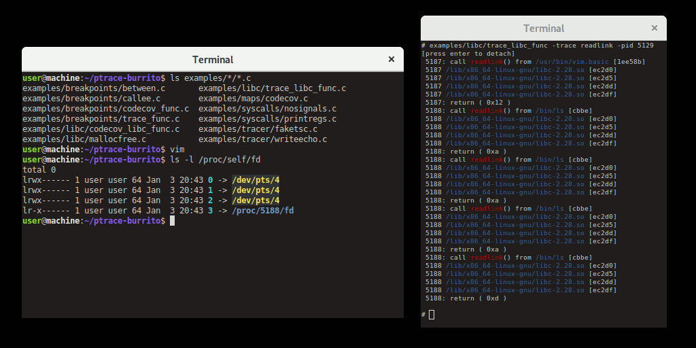

Ptrace-burrito, a friendly wrapper around ptrace
========

A plugin style wrapper around ptrace on Linux.

Supports:

* Tracing a complete process tree
* Attaching to running processes
* Hardware breakpoint/watchpoint support
* Automatic persistent breakpoints across exec
* Injecting system calls
* On-demand switching from/to step tracing
* Step-tracing & using watchpoints & getting syscall events at the same time
* Graceful detach
* Some very basic symbol resolution
* Easy tags support to record code-coverage on binaries

For now, only Linux-x86\_64 is supported, but architecture specific code is
contained in only a few sections.

For a How-To best check out the [examples](examples/)

